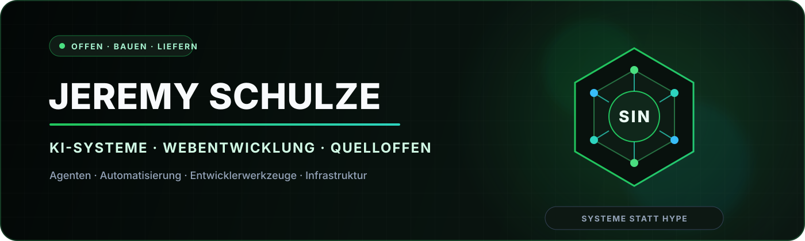
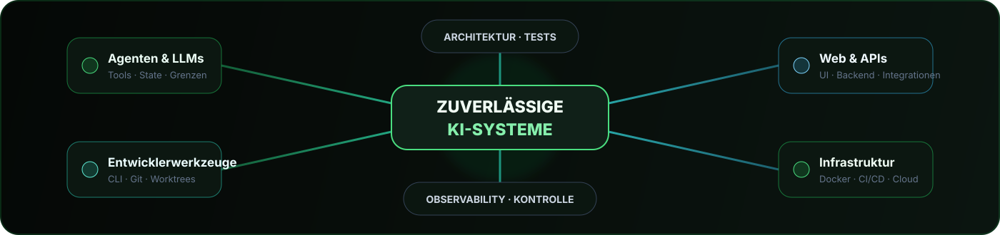
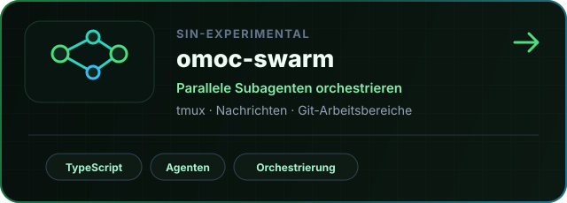
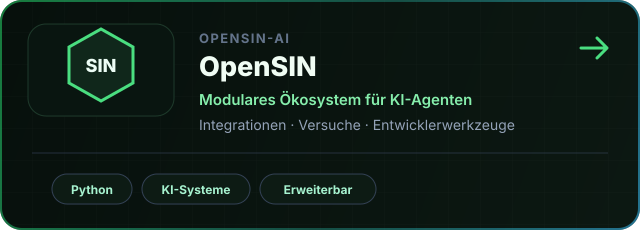
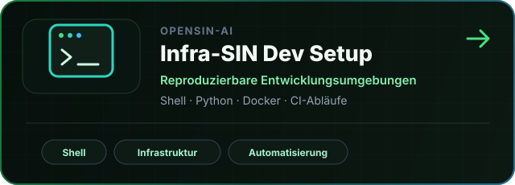
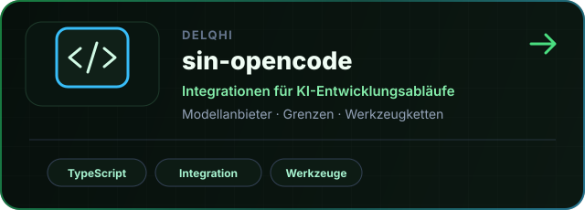

  

   
   

  
  
  

   

  
  

---

## 👋 Über mich

Ich bin **Softwareentwickler mit Schwerpunkt auf KI-Systemen, Agenten-Orchestrierung, Automatisierung sowie moderner Web- und Anwendungsentwicklung**.

Mich interessieren keine einmaligen KI-Demos, sondern Systeme, die sich nachvollziehen, testen, betreiben und weiterentwickeln lassen. Dafür verbinde ich LLMs und Agenten mit klaren Schnittstellen, reproduzierbaren Entwicklungsumgebungen, solider Infrastruktur und menschlicher Kontrolle.

<table>
  <tr>
    <td width="25%" align="center"><strong>🧠 KI-Systeme</strong> Agenten, Tools, State und Orchestrierung</td>
    <td width="25%" align="center"><strong>⚙️ Automatisierung</strong> CLI, Git, Browser- und Desktop-Workflows</td>
    <td width="25%" align="center"><strong>🌐 Webentwicklung</strong> Weboberflächen, APIs und Integrationen</td>
    <td width="25%" align="center"><strong>🏗️ Infrastruktur</strong> Docker, CI/CD, Linux, macOS und Cloud</td>
  </tr>
</table>

 

---

## 🚀 Ausgewählte Projekte

<table>
  <tr>
    <td width="50%" valign="top">
      
       
      
      
    </td>
    <td width="50%" valign="top">
      
       
      
      
    </td>
  </tr>
  <tr>
    <td width="50%" valign="top">
      
       
      
      
    </td>
    <td width="50%" valign="top">
      
       
      
      
    </td>
  </tr>
</table>

---

## 🛠️ Technologien und Werkzeuge

### Sprachen und Anwendungen

### KI und Agentensysteme

### Infrastruktur und Entwicklung

---

## 📐 Wie ich entwickle

<table>
  <tr>
    <td width="50%" valign="top">
      <h3>🏭 Betrieb statt Demo</h3>
      
Software muss nicht nur einmal funktionieren, sondern verständlich, beobachtbar und langfristig wartbar bleiben.

    </td>
    <td width="50%" valign="top">
      <h3>🧩 Explizite Schnittstellen</h3>
      
Komponenten sollen klar abgegrenzt, austauschbar und unabhängig testbar sein.

    </td>
  </tr>
  <tr>
    <td width="50%" valign="top">
      <h3>🔎 Nachweise statt Behauptungen</h3>
      
Tests, reproduzierbare Abläufe und funktionierende Software sind wichtiger als große Marketingversprechen.

    </td>
    <td width="50%" valign="top">
      <h3>🛡️ Automatisierung mit Kontrolle</h3>
      
Wiederholbare Arbeit wird automatisiert, ohne Transparenz, Sicherheit oder menschliche Eingriffsmöglichkeiten zu verlieren.

    </td>
  </tr>
</table>

---

## 📊 GitHub-Aktivität

  
  
  

 

  

---

## 🤝 Austausch und Zusammenarbeit

Ich freue mich über fachlichen Austausch zu **KI-Agenten, Entwicklerwerkzeugen, Automatisierung, quelloffener Software und moderner Softwarearchitektur**.

  
  

 

  Entwickelt mit Fokus auf klare Systeme, nachvollziehbare Ergebnisse und nachhaltige Open-Source-Arbeit.

